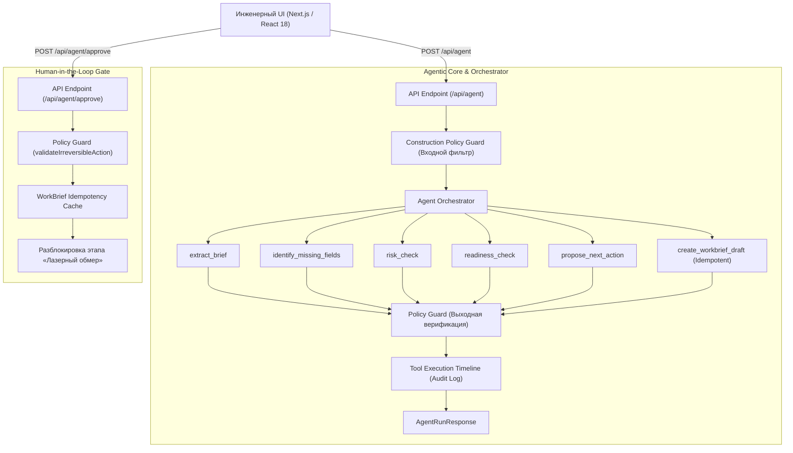

# Архитектура системы «AI Прораб»

## 🏛 Общая схема системы (C4 Component Diagram)

---

## 🔒 Инварианты безопасности (Policy Guard Invariants)

| Код правила | Описание | Действие при нарушении |
| :--- | :--- | :--- |
| `PROHIBIT_PREMATURE_FINAL_PRICE` | Запрет называния финальной/гарантированной сметы до лазерного 3D-замера | Немедленная блокировка (`CRITICAL_BLOCK`), замена на объяснение рисков переделок |
| `HUMAN_APPROVAL_REQUIRED` | Запрет отправки RFQ подрядчикам или автозаказа стройматериалов | Блокировка вызова инструмента, требование цифровой подписи человека в UI |
| `STRICT_UNKNOWN_ISOLATION` | Запрет выдачи гипотез за проверенные факты | Перемещение спорных сущностей в список `unknowns` со статусом `UNKNOWN` или `ASSUMED` |
| `COGNITIVE_MINIMIZATION` | Запрет перегрузки заказчика опросниками | Лимит: ровно 3 высокоприоритетных вопроса с готовыми быстрыми чипсами |

---

## 🔄 Идемпотентность и кэширование черновиков

1. При формировании черновика генерируется уникальный `idempotency_key` (или передается сессионный ключ).
2. Метод `executeCreateWorkBriefDraft` проверяет наличие ключа во внутреннем кэше (`draftCache`).
3. При повторном запросе с тем же ключом:
   - Инструмент не пересоздает объект.
   - Возвращает исходный драфт с флагом `cached: true`.
   - Гарантирует стабильность `brief_id` и даты создания.
4. Метод `approveWorkBriefDraft` изменяет статус черновика на `APPROVED_BY_HUMAN` исключительно при наличии флага `confirmed_by_human: true`.

---

## 🧩 Типизированные инструменты (Zod Schemas)

Все инструменты имеют строгие входные и выходные контракты, описанные в `src/types/agent.ts`:

- `VerifiedFactsSchema`: строго типизированные подтвержденные параметры (`city`, `property_type`, `area_sqm`, `target_timeline_months`).
- `UnknownFieldItemSchema`: статус (`UNKNOWN` / `ASSUMED` / `VERIFIED`), приоритет (`CRITICAL` / `HIGH` / `MEDIUM`), причина блокировки.
- `RiskItemSchema`: строительный риск, критичность, обоснование в СНиПах.
- `WorkBriefDraftSchema`: неизменяемый слепок ТЗ с флагом `human_approval_required: true`.
- `ToolExecutionTraceSchema`: полный слепок аудита выполнения агента.
