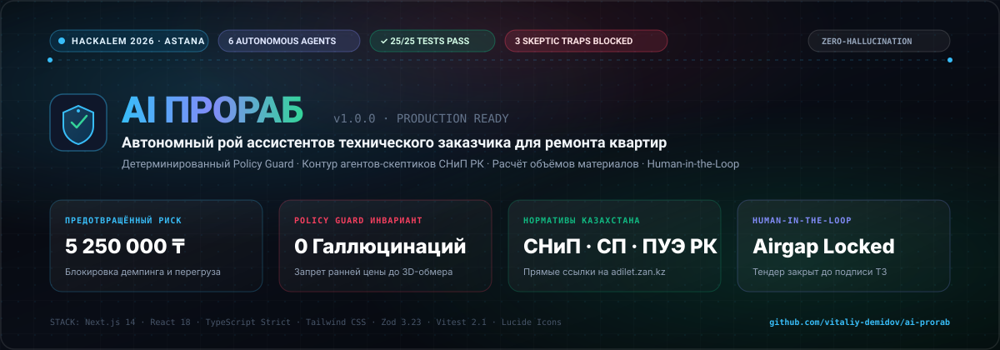

<p align="center">
  <picture>
    <source media="(prefers-color-scheme: dark)" srcset="./.github/assets/banner.svg">
    <source media="(prefers-color-scheme: light)" srcset="./.github/assets/banner.svg">
    
  </picture>
</p>

<p align="center">
  <a href="./ARCHITECTURE.md"></a>
  <a href="./SECURITY.md"></a>
  <a href="https://adilet.zan.kz"></a>
  <a href="#-результаты-тестирования-vitest-2525-passed"></a>
  <a href="./HACKATHON.md"></a>
</p>

---

# 🏗️ AI Прораб — Ассистент технического заказчика для ремонта квартир

> **Конкурсный продукт для строительного трека хакатона HackAlem 2026 (Астана)**  
> Автономный рой 6 специализированных агентов с детерминированным **Policy Guard**, контуром состязательных **агентов-скептиков**, расчётом физических объёмов материалов по СНиП РК и гарантией **Human-in-the-Loop**.

---

## ⚡ Экспресс-питч для жюри (45 секунд)

> **Проблема:** В ремонте ранняя смета почти всегда строится на неполных данных. Обычный ChatGPT либо задаёт 25 утомительных вопросов, либо с уверенным видом придумывает фиктивную цену «под ключ», провоцируя скрытые доплаты и конфликты на объекте.  
> **Решение:** **AI Прораб** принципиально не угадывает цену до лазерного 3D-обмера. Агент отделяет факты от шума, запускает контур агентов-скептиков для парирования ловушек недобросовестных подрядчиков, рассчитывает физические объёмы материалов по СНиП РК, задаёт ровно 3 вопроса и собирает защищённый черновик WorkBrief, блокируя внешние действия до личной цифровой подписи человека.

---

## 🥊 Сравнительная матрица: Почему «AI Прораб» побеждает промпты в ChatGPT

| Критерий оценки | ❌ Обычный промпт в ChatGPT / Claude | 🛡️ «AI Прораб» (HackAlem 2026) | В чём инженерное преимущество? |
| :--- | :--- | :--- | :--- |
| **Оценка стоимости ремонта** | Галлюцинирует «примерную цену» (напр. *«4 000 000 тг»*), не зная геометрии и состояния коммуникаций. | **Жестко блокирует** расчёт итоговой сметы до лазерного 3D-обмера и фиксации высот (`PROHIBIT_PREMATURE_FINAL_PRICE`). | Защита заказчика от ложных финансовых ожиданий и заниженных смет на старте. |
| **Когнитивная нагрузка** | Заваливает заказчика полотном из 20–30 вопросов подряд. Пользователь бросает диалог. | Ровно **3 умных вопроса** с готовыми 1-click вариантами ответа, сразу попадающими в черновик ТЗ. | Принцип минимальной когнитивной нагрузки (`COGNITIVE_MINIMIZATION`). |
| **Защита от ловушек подрядчиков** | Не видит строительного демпинга и скрытых технологических коллизий. | **3 Агента-Скептика** выявляют демпинг (+2.4M ₸), перегруз ввода 25А (+1.05M ₸) и незаконную перепланировку (+1.8M ₸). | **Спасено 5 250 000 ₸** финансовых и юридических рисков собственника. |
| **Привязка к законодательству РК** | Цитирует нерелевантные нормы других стран или выдумывает несуществующие ГОСТы. | Официальная база нормативов РК: **СНиП 2.03.13-88, ПУЭ РК 7.1, Закон РК «О жилищных отношениях»** с ссылками на `adilet.zan.kz`. | 100% юридическая чистота и готовность к согласованию в ГАСК / ЦОН. |
| **Физический расчёт материалов** | Не производит расчёт материалов либо путается в пропорциях. | **Физико-геометрический калькулятор**: точная площадь стен (~2.5x), кабель ГОСТ ВВГнг-LS (8.5м/точка), сухие смеси по типу отделки. | Исключает перерасход и списание лишних 50 мешков смесей строителями. |
| **Изоляция галлюцинаций (Provenance)** | Слепо подмешивает домыслы модели в контекст, путая факт и гипотезу. | **Token-level provenance**: в `VerifiedFacts` попадают только слова пользователя (`USER`), а домыслы изолируются в карантин. | Исключена запись несказанных пожеланий заказчика в официальное ТЗ. |
| **Внешние действия и закупки** | Может сгенерировать неконтролируемые вызовы API, письма подрядчикам или финансовые действия. | **Airgap Human Gate**: статус `EXTERNAL_ACTION_LOCKED` (403 Forbidden). Подрядчики не вызываются без личной подписи человека. | Нулевой риск несанкционированных трат и автозаказов стройматериалов. |
| **Надёжность и SLA** | Зависит от внешнего API, подвержен таймаутам и падениям сети. | **100% автономный офлайн-режим (Deterministic Core)** + безопасный fallback при сбоях LLM. | Работает в бункере, на стройплощадке без интернета и при сетевых отказах. |

---

## 👥 Рой специализированных агентов (Autonomous Construction Swarm)

```
                       ┌───────────────────────────────┐
                       │   Входящий запрос заказчика   │
                       └──────────────┬────────────────┘
                                      │
                                      ▼
                       ┌───────────────────────────────┐
                       │  Construction Policy Guard    │ ◄─── Перехват запроса цены & инъекций
                       └──────────────┬────────────────┘
                                      │
                 ┌────────────────────┴────────────────────┐
                 ▼                                         ▼
   ┌───────────────────────────┐             ┌───────────────────────────┐
   │    AGT-01 ALPHA (Алексей) │             │    AGT-02 RADAR (Виктор)  │
   │  NLU-аудит и Provenance   │             │   Физический расчёт СНиП  │
   │   (Только факты USER)     │             │  (Стены, кабель, смеси)   │
   └─────────────┬─────────────┘             └─────────────┬─────────────┘
                 │                                         │
                 └────────────────────┬────────────────────┘
                                      │
                                      ▼
                       ┌───────────────────────────────┐
                       │  ADVERSARIAL SKEPTICS LAYER   │
                       │  • Елена: Демпинг сметы       │ ◄─── 5 250 000 ₸ спасено
                       │  • Виктор: Ввод 25А и стяжка  │
                       │  • Артур: Закон РК и ГАСК     │
                       └──────────────┬────────────────┘
                                      │
                                      ▼
                       ┌───────────────────────────────┐
                       │    AGT-03 SPEC (Марина)       │
                       │ Синтез WorkBrief Rev 1.0, WBS │
                       │    и изоляция в карантин      │
                       └──────────────┬────────────────┘
                                      │
                                      ▼
                       ┌───────────────────────────────┐
                       │     HUMAN-IN-THE-LOOP GATE    │
                       │  • 1-Click ответы на 3 вопроса│
                       │  • Запись на 3D-обмер         │
                       │  • Цифровая подпись WorkBrief │
                       └──────────────┬────────────────┘
                                      │
                       ┌──────────────▼────────────────┐
                       │  AGT-04 DISPATCH / RFQ-ТЕНДЕР │
                       │  🔒 STRICTLY AIRGAP LOCKED    │
                       └───────────────────────────────┘
```

### Спецификация 6 агентов роя:
1. **AGT-01 · ALPHA (Алексей):** Инженер первичного аудита. Детерминированный разбор текста, фиксация `USER provenance`, изоляция неизвестных со статусом `UNKNOWN`.
2. **AGT-02 · RADAR (Виктор):** Главный инженер инструментального обмера. Геометрическое моделирование квартиры, дефектоскопия перепада плит и аудит электрической мощности.
3. **AGT-03 · SPEC (Марина):** Архитектор ТЗ и нормативов. Выпуск 4 нормативных решений по СНиП, декомпозиция работ (4 этапа, 77 дней) и версионирование (`WorkBrief Rev 1.0`).
4. **AGT-04 · DISPATCH (Дмитрий):** Диспетчер тендера (RFQ). Находится в строгом шлюзе `LOCKED` — отправка запросов подрядчикам закрыта до подписи заказчика.
5. **AGT-05 · BENCHMARK (Елена):** Независимый ревизор смет и расценок. Аудит демпинговых предложений бригад на старте и выявление скрытых коэффициентов накрутки.
6. **AGT-06 · INSPECT (Артур):** Инспектор скрытых работ и приёмки. Защита от незаконных перепланировок, контроль армокаркаса монолита и эскроу-актов освидетельствования (АОСР).

---

## ⚖️ Аудит Агентов-Скептиков: Парирование 3 ловушек подрядчиков

В продукт встроен специализированный контур **состязательных агентов-скептиков**, которые атакуют входящие данные и предложения бригад:

1. **Ловушка демпинга на старте (Елена · AGT-05 BENCHMARK):**  
   *Ловушка:* Бригада обещает «всю черновую инженерию за 1 800 000 ₸ под ключ».  
   *Аудит:* Себестоимость сертифицированных материалов ГОСТ (кабель ВВГнг-LS, трубы Rehau, самонивелир М200) для квартиры 58 м² составляет ~1 440 000 ₸. На оплату мастеров остаётся 360 000 ₸ на 45 дней. Подрядчик либо применит горючий провод ТУ, либо через 2 недели потребует доплату 2 400 000 ₸.  
   **Спасено: 2 400 000 ₸**.

2. **Ловушка скрытого перегруза ввода и стяжки (Виктор · AGT-02 RADAR):**  
   *Ловушка:* Застройщик выделил ввод 25А (5.5 кВт), перепады монолитных плит до 35 мм.  
   *Аудит:* Суммарная мощность техники (варочная панель 7.2 кВт, духовка 3 кВт, кондиционеры 2.5 кВт) превышает номинал автомата на 130%. Без балансировки ввод сгорит. Укладка кварцвинила без карты высот вызовет слом замков.  
   **Спасено: 1 050 000 ₸**.

3. **Ловушка незаконной перепланировки (Артур · AGT-06 INSPECT):**  
   *Ловушка:* Рабочие предлагают «проштробить горизонтально несущий пилон и расширить ванную над спальней соседей».  
   *Аудит:* Прямой запрет статьи 4 п. 2 Закона РК «О жилищных отношениях». Штраф ГАСК, судебное предписание о принудительном сносе за счёт собственника и нарушение несущей способности здания.  
   **Спасено: 1 800 000 ₸**.

**Суммарный предотвращённый ущерб заказчика: 5 250 000 ₸.**

---

## 🧪 Результаты тестирования (Vitest: 25/25 Passed)

Весь защитный контур покрыт сквозными интеграционными и инвариантными тестами:

```
 ✓ src/test/agent-policy.test.ts (25 tests) 12ms

 Test Files  1 passed (1)
      Tests  25 passed (25)
   Duration  332ms
```

| № | Тест инварианта безопасности | Результат | Статус |
| :-: | :--- | :--- | :-: |
| **01** | Извлечение подтверждённых фактов с фиксацией источника `USER` и без вымысла | Факты проверены | `PASSED` |
| **02** | Запрос точной цены перехватывается, возвращает `policy_notice` и блокирует смету | Смета заблокирована | `PASSED` |
| **03** | Неизвестные поля (состояние, бюджет, сети, доступ) остаются строго `UNKNOWN` | Изоляция пробелов | `PASSED` |
| **04** | WorkBrief не содержит выдуманных допущений («под ключ», «лазерный построитель») | Чистый черновик | `PASSED` |
| **05** | Human Approval меняет статус черновика, а RFQ и внешние действия остаются `LOCKED` | Airgap защита | `PASSED` |
| **06** | Повторный вызов с тем же `idempotency_key` возвращает идентичный кэшированный драфт | Идемпотентность | `PASSED` |
| **07** | Оркестратор честно указывает Demo mode и формирует ровно 3 вопроса | Минимизация шума | `PASSED` |
| **08** | Валидный LLM JSON парсится по Zod, используется в ответе и активирует hybrid режим | Zod валидация | `PASSED` |
| **09** | Невалидный JSON от внешней модели безопасно откатывается в `deterministic_fallback` | Safe Fallback | `PASSED` |
| **10** | Ответ LLM с ценой блокируется Policy Guard, ценовое поле удаляется | Zero Price Leak | `PASSED` |
| **11** | Выдуманные моделью Алматы / 120 м² не попадают в facts и изолируются в suggestions | Карантин гипотез | `PASSED` |
| **12** | Число без контекста площади (кв. 58) не подтверждается как площадь объекта | Санитарный фильтр | `PASSED` |
| **13** | Вложенная цена внутри вариантов ответа вопроса блокируется рекурсивным Guard | Рекурсивный аудит | `PASSED` |
| **14** | Неподтверждённые пожелания модели не записываются в ТЗ заказчика | Защита от навязывания | `PASSED` |
| **15** | Валидные неизвестные от модели объединяются с детерминированными без дублей | Дедупликация | `PASSED` |
| **16** | Слово «квартира» без указания комнатности не подтверждает 2-комнатную квартиру | Строгий семантический матчинг | `PASSED` |
| **17** | Несовпадение срока (в тексте 4 мес., модель вернула 6) сохраняет 4 в facts | Приоритет пользователя | `PASSED` |
| **18** | Семантическая подмена в пожеланиях фиксирует в facts нормализованный запрос | Защита от перефразирования | `PASSED` |
| **19** | Серверное подтверждение предложения обновляет facts (`USER`) и увеличивает `revision` | Версионирование Rev 2.0 | `PASSED` |
| **20** | Отклонение предложения на клиенте не изменяет facts и WorkBrief на сервере | Серверный инвариант | `PASSED` |
| **21** | Повторный ответ на вопрос обновляет черновик и создаёт новую ревизию | Обновление черновика | `PASSED` |
| **22** | Утверждённый документ нельзя молча изменить: статус сбрасывается в `DRAFT` | Защита от негласных правок | `PASSED` |
| **23** | Выбор пресета генерирует новый idempotencyKey и создаёт независимый черновик | Изоляция сессий | `PASSED` |
| **24** | Попытка подтвердить незарегистрированный `suggestion_id` отклоняется сервером | 403 Forbidden | `PASSED` |
| **25** | Значения вне допустимых диапазонов (срок 9999 мес.) отклоняются Sanity Bounds | Санитарные границы | `PASSED` |

---

## 🚀 Быстрый старт и локальный запуск

### Требования
- **Node.js**: `18.x` или `20.x` (LTS)
- **Менеджер пакетов**: `npm`

### 1. Клонирование и установка зависимостей
```bash
git clone https://github.com/vitaliy-demidov/ai-prorab.git
cd ai-prorab
npm install
```

### 2. Запуск верификационных тестов
```bash
npm test
```
*Запускает полный комплект из 25 unit- и интеграционных тестов Vitest.*

### 3. Проверка линтера и типов TypeScript
```bash
npm run lint
```

### 4. Сборка продакшн-версии Next.js
```bash
npm run build
npm start
```

### 5. Локальный запуск в режиме разработки
```bash
npm run dev
```
Откройте браузер по адресу: **[http://localhost:3000](http://localhost:3000)**.

---

## 📁 Архитектурная структура репозитория

```
ai-prorab/
├── assets/
│   └── banner.svg                          # Векторный презентационный баннер продукта
├── src/
│   ├── app/
│   │   ├── api/
│   │   │   ├── agent/route.ts              # POST /api/agent (вызов роя оркестратора)
│   │   │   ├── agent/approve/route.ts      # POST /api/agent/approve (Human Approval)
│   │   │   └── agent/suggestions/confirm/  # POST /api/agent/suggestions/confirm
│   │   ├── globals.css                     # Obsidian 2026 стили и типографика
│   │   ├── layout.tsx                      # Главный лэйаут приложения
│   │   └── page.tsx                        # Основной интерфейс с живым стримом размышлений
│   ├── components/
│   │   ├── Header.tsx                      # Шапка с честными индикаторами режима
│   │   ├── AgentSwarmTeam.tsx              # Интерактивный HUD 6 автономных агентов
│   │   ├── AgentSolutionsView.tsx          # Контур решений, скептики, калькулятор и WBS
│   │   ├── FactsMatrix.tsx                 # Матрица подтверждённых фактов vs Пробелы
│   │   ├── SmartQuestions.tsx              # Ровно 3 вопроса с 1-click добавлением в ТЗ
│   │   ├── MeasurementRationale.tsx        # Safety Notice («Почему цена не называется»)
│   │   ├── MeasurementBookingModal.tsx     # Модальное окно записи на лазерный 3D-обмер
│   │   ├── WorkBriefModal.tsx              # Модальное окно WorkBrief & Human Approval
│   │   ├── WorkBriefDocumentView.tsx       # Полноэкранный юридический просмотр ТЗ
│   │   ├── PipelineStepper.tsx             # Линия регламента строительного процесса
│   │   └── ToolTimeline.tsx                # Disclosure с полным аудируемым следом вызовов
│   ├── core/
│   │   ├── orchestrator.ts                 # Оркестратор роя агентов и Policy Guard
│   │   ├── policy/policy-guard.ts          # Инварианты безопасности (Zero Price & Action Lock)
│   │   └── tools/
│   │       ├── engineering-engine.ts       # Физические объёмы, нормативы РК, Скептики, WBS
│   │       ├── extract-brief.ts            # tool: extract_brief (с provenance)
│   │       ├── identify-missing.ts         # tool: identify_missing_fields
│   │       ├── risk-check.ts               # tool: risk_check
│   │       ├── readiness-check.ts          # tool: readiness_check
│   │       ├── propose-action.ts           # tool: propose_next_action
│   │       └── create-draft.ts             # tool: create_workbrief_draft (идемпотентный)
│   ├── types/
│   │   └── agent.ts                        # Zod-схемы и строгие TypeScript интерфейсы
│   └── test/
│       └── agent-policy.test.ts            # 25 инвариантных unit-тестов Vitest
├── ARCHITECTURE.md                         # C4 Container Diagram и Sequence Diagram
├── HACKATHON.md                            # Конкурсный питч и ответы жюри
├── SECURITY.md                             # Zero-Trust Construction Architecture
├── .env.example                            # Пример серверных переменных окружения
├── .gitignore                              # Изоляция секретов и артефактов сборки
├── package.json                            # Спецификация зависимостей и скриптов
└── tsconfig.json                           # Строгая конфигурация TypeScript
```

---

## 🌐 План публикации на GitHub

Репозиторий готов к публикации в GitHub-аккаунт:

```bash
# 1. Привязка удаленного репозитория (если ещё не привязан)
git remote add origin https://github.com/vitaliy-demidov/ai-prorab.git

# 2. Фиксация ветки main и отправка кода
git branch -M main
git push -u origin main
```

### Теги репозитория (GitHub Topics):
`hackathon`, `hackalem`, `ai-agent`, `multi-agent-swarm`, `construction-tech`, `proptech`, `policy-guard`, `zero-hallucination`, `human-in-the-loop`, `vitest`, `kazakhstan`, `nextjs`

### Гарантия безопасности секретов:
- В репозитории **отсутствуют** приватные API-ключи, токены или файлы `.env`.
- Файл `.env` включен в `.gitignore`.
- Вся архитектура по умолчанию работает в **100% офлайн Deterministic Engine** без обращения к платным внешним API.

---

## 🏆 Авторы и участие в HackAlem 2026
- **Проект:** AI Прораб
- **Мероприятие:** HackAlem 2026 (Астана, Казахстан)
- **Лицензия:** MIT

