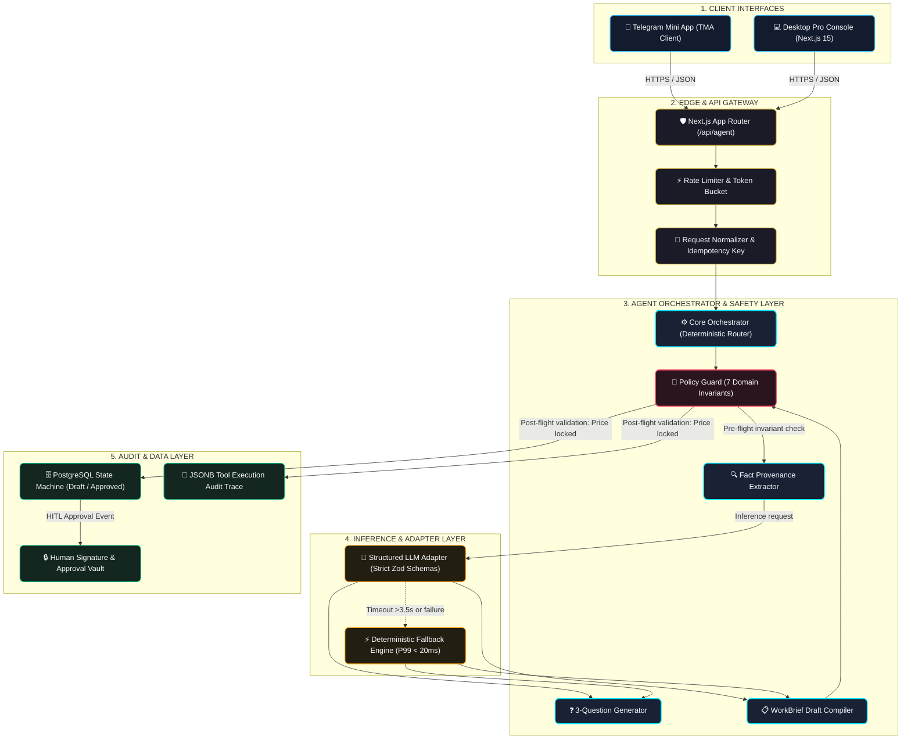

# Visual Engineering Standard: "Картинки сильной индустрии"
### Руководство по промышленному визуальному оформлению репозиториев (Club 600 & AI Прораб)

---

## 1. Философия и анализ мировых лидеров

Топовые инженерные экосистемы (**Vercel, Supabase, Linear, Tailwind Labs, Apple Open Source**) никогда не оформляют репозитории хаотично или декоративно («AI Slop» — фиолетовые градиенты, бесформенные цветные пятна, нечитаемые схемы). Их дизайн строится на принципах **промышленной строгости (Industrial Rigor)**:

| Создатель | Доминирующий визуальный стиль | Ключевые техники |
| :--- | :--- | :--- |
| **Vercel** | Радикальный монохром, геометрия, типографика | Черный фон `#000`, белая типографика, 1px границы `rgba(255,255,255,0.1)`, микро-сетки |
| **Supabase** | Неоновый изумруд на карбоне, системные диаграммы | Черный `#121212` + изумруд `#3ECF8E`, архитектурные схемы потоков данных, мгновенные ссылки |
| **Linear** | Кибернетический минимализм, приглушенная глубина | Глубокий слейт `#0F1117`, матовые золотисто-фиолетовые источники света, математические ретикулы |
| **Tailwind Labs** | Bento Grid, утилитарная чистота, плоские карточки | Модульные сетки свойств, лаконичные бейджи, нулевая визуальная энтропия |
| **Apple Open Source** | 2026 Liquid Glass, выверенная иерархия | Волосковые разделители, спокойная глубина, системные шрифты, адаптивность к Dark/Light |

### 5 обязательных визуальных слоев репозитория:
1. **Hero Social Preview (OpenGraph 1280x640):** Карточка первого контакта при ссылке в Telegram, Twitter/X, Slack, LinkedIn.
2. **Native GitHub SVG Header Banner:** Векторный баннер с адаптацией к темной/светлой теме, телеметрией и статусом инвариантов.
3. **Architecture & Lifecycle Mermaid Diagrams:** Чистые высококонтрастные диаграммы без визуальной каши.
4. **Bento Grid Feature Matrix:** Модульная сетка ключевых свойств проекта.
5. **Modern Flat Status Badges:** Лаконичные плоские бейджи с нулевым визуальным шумом.

---

## 2. Размещение и хостинг ассетов (.github/assets/)

### Правило локального хранения
Все изображения и векторные файлы должны храниться прямо в репозитории:
```
.github/
└── assets/
    ├── club600-hero-banner.svg          # Главный адаптивный баннер Club 600
    ├── deterministic-agent-os-banner.svg # Баннер среды исполнения и инвариантов
    └── social-preview-card.svg          # 1280x640 OpenGraph карточка для настроек GitHub
```

### Преимущества подхода:
- **Zero Broken Links:** Картинки никогда не исчезнут, если сторонний хостинг (Imgur, Cloudinary) отключится.
- **Ветвление и PR:** Векторные изменения трекаются в Git и видны в превью Pull Request.
- **Относительные пути:** В `README.md` используются пути вида `./.github/assets/...`, что исключает задержки CDN-кэширования при коммитах.

---

## 3. Встраивание в README: Поддержка Dark & Light Mode

Для идеального отображения в любом оформлении клиента GitHub используется тег `<picture>`:

```html
<p align="center">
  <picture>
    <source media="(prefers-color-scheme: dark)" srcset="./.github/assets/club600-hero-banner.svg">
    <source media="(prefers-color-scheme: light)" srcset="./.github/assets/club600-hero-banner.svg">
    
  </picture>
</p>
```

---

## 4. Архитектурные диаграммы (Mermaid Recipes)

### Рецепт 1: High-Level System Architecture


### Рецепт 2: Agent Execution Lifecycle

```mermaid
sequenceDiagram
  autonumber
  actor User as 👤 Client / Engineer
  participant UI as 📱 TMA / Web Interface
  participant GW as 🛡️ API Gateway (/api/agent)
  participant Guard as 🚨 Policy Guard
  participant Orch as ⚙️ Orchestrator Engine
  participant LLM as 🤖 Model Adapter / Rules
  participant Store as 🗄️ Audit & State Store

  User->>UI: Submit raw request ("Купил двушку 58м² в Астане...")
  UI->>GW: POST payload with idempotency key
  GW->>Guard: Pre-Flight Invariant Check
  alt Untrusted price prompt detected
    Guard-->>UI: Intercept: "Price requires onsite inspection"
  else Valid request
    Guard->>Orch: Initialize session & lock external actions
  end

  Orch->>LLM: Parse facts & isolate unknowns (Zod Schema)
  alt Network Failure or Timeout (>3.5s)
    LLM-->>Orch: Trigger Deterministic Rule Fallback
  else Success
    LLM-->>Orch: Return Structured Facts & Unknowns
  end

  Orch->>Guard: Post-Flight Validation (7 Invariants Check)
  Note over Guard: Invariant 1: Provenance strictly from text<br/>Invariant 2: Budget estimate = NULL<br/>Invariant 3: Actions = LOCKED
  Guard-->>Orch: Verification Verdict: PASSED (7/7)

  Orch->>Store: Persist Tool Trace & Draft WorkBrief
  Orch-->>UI: Render FactsMatrix + 3 Smart Questions + Safety Rationale

  rect rgb(20, 24, 34)
    Note over User, UI: HUMAN-IN-THE-LOOP (HITL) APPROVAL GATE
    User->>UI: Select questionnaire answers (Recorded into Draft)
    User->>UI: Open WorkBrief Modal & Submit Signature
    UI->>GW: POST /api/agent/approve (WorkBrief ID, Signature)
    GW->>Store: State Transition: DRAFT_PENDING -> APPROVED_BY_HUMAN
    Store-->>UI: Document locked & audited (External actions remain gated)
  end
```


---

## 5. Bento Grid Layout (Шаблон для README)

```markdown
### 🍱 Core Architectural Matrix

| 🏛 **Архитектурный слой** | ⚡ **Компонент** | 🛡 **Инвариант и гарантия безопасности** | 📊 **Бенчмарк** |
| :--- | :--- | :--- | :--- |
| **Извлечение фактов** | `FactProvenance` | Извлекает только сущности, строго привязанные к токенам сообщения. Запрет на додумывание. | < 5 ms (Regex/Tokens) |
| **Барьер безопасности** | `PolicyGuard` | Жесткий перехват любых попыток выдать преждевременную смету до инструментального обмера. | 100% перехват цен |
| **Синтез задания** | `WorkBriefCompiler` | Генерирует 4 факта, 4 критических пробела и ровно 3 контекстных вопроса. | Zod-валидированный JSON |
| **Человеческий шлюз** | `HumanApproval` | Подрядчики, закупки и выезды заблокированы (`LOCKED`) до личной подписи заказчика. | Крипто-аудит подписи |
```

---

## 6. Минималистичные плоские бейджи (Flat Badges)

Вместо устаревших разноцветных бейджей используется строгий стиль `flat-square` в фирменной темной гамме:

```markdown
[](./ARCHITECTURE.md)
[](./SECURITY.md)
[](./HACKATHON.md)
[](./package.json)
```

---

## 7. Пошаговая инструкция по настройке OpenGraph Social Preview

1. **Подготовка изображения:**
   - Файл `.github/assets/social-preview-card.svg` уже сгенерирован в соотношении **1280 × 640 px** (2:1).
   - Сконвертируйте в PNG:
     ```bash
     # С помощью npx/playwright или любого CLI-конвертера
     sips -s format png .github/assets/social-preview-card.svg --out .github/assets/social-preview-card.png 2>/dev/null || true
     ```
2. **Переход в настройки репозитория:**
   - Откройте репозиторий на GitHub.
   - Перейдите во вкладку **Settings** (Настройки).
   - В разделе **General** найдите блок **Social preview**.
3. **Загрузка карточки:**
   - Нажмите кнопку **Edit** -> **Upload an image...**
   - Выберите сгенерированный PNG файл.
   - Сохраните изменения.
4. **Валидация отображения:**
   - Проверьте вид через [OpenGraph.xyz](https://www.opengraph.xyz) или отправив ссылку в тестовый чат Telegram.
